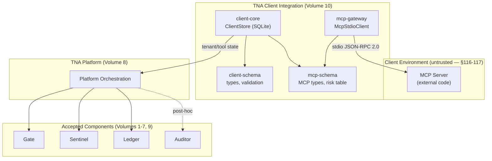

# TNA Client Integration & MCP Gateway v0.1 — Overview

## What this is

TNA Client Integration & MCP Gateway v0.1 (Volume 10) is the client-onboarding control plane: the
machinery that makes an external client — an organization's own agent system — a governed participant
in TNA, with its own tenant identity, its own service credentials, and its own registered MCP servers
whose tools are discovered, classified, policy-bound, and gatekept before they ever reach the
existing execution pipeline.

This milestone does not replace any accepted component. The existing accepted products — Gate (v0.1–
v0.3), VAD Engine (v0.1), Ledger (v0.1), Sentinel (v0.1), Auditor (v0.1), Platform Integration
(v0.1), Deployment Engineering (v0.1) — remain untouched. Volume 10 extends the surface that sits
*before* the platform's own governed-action pipeline: the registration, discovery, review, and
lifecycle of external MCP servers and their tools, under a tenant-scoped, credential-authenticated
identity model.

## The control chain

```
CLIENT (external agent system)
  → TNA Client Integration (tenant identity, credential authentication)
  → TNA Platform (PlatformActionRequest, orchestration)
  → Gate (authorize) — ALLOW / BLOCK / HOLD
  → Capability issuance — Gate's ExecutionBroker, same accepted mediation
  → Sentinel session + pre-action check
  → TNA MCP Gateway (real stdio JSON-RPC 2.0 to the MCP server)
  → MCP Server (external code, untrusted — §116)
  → Tool execution
  → (optional) VAD verification
  → Ledger evidence (transactional outbox)
  → (post-hoc, optional) Auditor assessment
```

## Architecture

```
packages/
  client-schema/     ClientTenant, ClientServiceIdentity, credentials, risk/readiness
                     vocabulary, secret detection. No I/O.
  client-core/       ClientStore (SQLite, WAL, CAS): tenants, service identities,
                     MCP servers, governed tools, discovery reconciliation, policy
                     bindings, offboarding cascade.
  mcp-schema/        MCP error codes, server registration validation, governed tool
                     types, risk classification table, schema hashing. No I/O.
  mcp-gateway/       McpStdioClient: real stdio JSON-RPC 2.0, bounded timeouts,
                     process cleanup, INDETERMINATE on crash.

scripts/
  fixtures/mcp-fixture-server.ts   Real local MCP fixture with 6 failure modes.
```

## Architecture diagram



## Relationship to Volumes 1–9

| Volume | Component | Relationship |
|---|---|---|
| 1–3 | Gate v0.1–v0.3 | Volume 10's governed tools become Gate-authorized actions; tool identity is UUID-based, not name-based |
| 4 | VAD Engine v0.1 | Tools with `requires_vad: true` route through VAD after execution |
| 5 | Ledger v0.1 | All client integration events produce Ledger evidence |
| 6 | Sentinel v0.1 | Every MCP tool call passes Sentinel pre-action evaluation |
| 7 | Auditor v0.1 | Post-hoc governance assessment of client integration actions |
| 8 | Platform v0.1 | Volume 10's client actions flow through the platform's orchestration pipeline |
| 9 | Deployment v0.1 | Volume 10's stores follow the same deployment/health/backup discipline |

## Critical limitations (stated prominently, per §116–117)

**§116 — MCP servers are external code.** An MCP server is code the client organization provides and
operates. TNA does not audit, sandbox, or certify the MCP server binary. `mcp-gateway` spawns it
with `shell: false`, an explicit `argv`, and a bounded environment allowlist, but once the child
process is running, its internal behavior is outside TNA's observation boundary. The MCP server could
execute arbitrary code, make arbitrary network calls, or read arbitrary files its OS-level permissions
allow — TNA does not and cannot prevent this in v0.1. Sentinel observes the *interaction* between the
gateway and the server (tool calls, results, timing) but not the server's internal actions.

**§117 — Client environment bypass.** If the client's own host or process is compromised, every
control in this milestone that depends on the integrity of that environment (credential storage,
MCP server binary identity, environment-variable isolation) can be bypassed. This is the same
honest posture every prior TNA milestone takes for its own host — the difference is that Volume 10
explicitly extends this boundary to include the *client's* environment, which TNA does not control.

## Status

**In development — not yet accepted.** See `proof-of-work-client-integration-v0.1.md` and
`client-integration-threat-model-v0.1.md` before relying on this milestone.

## Documentation set

- `client-integration-overview-v0.1.md` — this document.
- `tenant-model-v0.1.md` — the tenant identity model and lifecycle.
- `service-identity-model-v0.1.md` — service identity, roles, credential binding.
- `credential-lifecycle-v0.1.md` — issuance, hashing, rotation, no-plaintext-persistence.
- `mcp-gateway-v0.1.md` — the MCP Gateway architecture and placement.
- `mcp-transport-v0.1.md` — stdio transport, process isolation, env allowlist.
- `governed-tool-model-v0.1.md` — GovernedToolDefinition and review statuses.
- `tool-discovery-v0.1.md` — discovery flow and reconciliation logic.
- `tool-risk-model-v0.1.md` — deterministic risk classification table.
- `tool-policy-binding-v0.1.md` — policy structure and binding at enable time.
- `tool-schema-drift-v0.1.md` — drift detection, impact, re-review requirement.
- `client-action-model-v0.1.md` — action flow, input binding, config snapshot.
- `client-health-v0.1.md` — health check semantics.
- `onboarding-readiness-v0.1.md` — readiness assessment and KNOWN_BYPASS meaning.
- `client-onboarding-runbook-v0.1.md` — step-by-step onboarding procedure.
- `mcp-operations-runbook-v0.1.md` — MCP server operational procedures.
- `client-offboarding-runbook-v0.1.md` — full offboarding procedure.
- `client-integration-threat-model-v0.1.md` — threat coverage and explicit non-mitigations.
- `client-integration-verification-v0.1.md` — test evidence.
- `client-integration-requirement-matrix-v0.1.md` — item-by-item scoring.
- `proof-of-work-client-integration-v0.1.md` — the full submission record.
