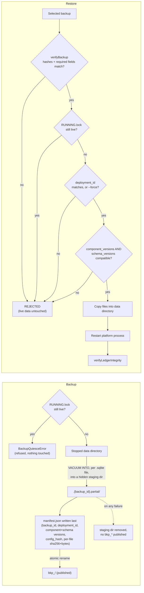

# TNA Deployment Engineering v0.1 — Backup

> **Recovery-consistency closure (post-submission).** The original Volume 9 submission below correctly
> described `VACUUM INTO`'s *per-file* consistency guarantee, but its "Concurrency" section overstated
> what that guarantee proves at the level of the whole backup *set* — see "Cross-component consistency"
> below and `deployment-v0.1-recovery-consistency-closure.md` for the full finding. The mechanism,
> content, and manifest sections are otherwise unchanged and remain accurate.

## Mechanism (section 39)

`createBackup(dataDir, backupsRoot, opts)` (`packages/deployment-ops`) enumerates every `*.sqlite` file
directly present in the data directory and, for each, opens a **fresh** `DatabaseSync` connection to the
live file and runs `VACUUM INTO ?` (a bound-parameter statement — confirmed supported by `node:sqlite`)
into the backup directory. `VACUUM INTO` is SQLite's own supported live-snapshot mechanism: it takes a
read transaction over the whole database and writes a fully consistent copy, safe against a concurrently
open WAL-mode writer (the live platform process). This is deliberately **not** `cp live.db backup.db`
(section 39's explicit warning) — a raw file copy against a live WAL-mode database can capture a
torn/inconsistent state.

## Content (section 40)

A backup captures every component database file (`tna-platform.sqlite`, `tna-ledger.sqlite`,
`tna-platform-sentinel.sqlite`, `tna-platform-gate.sqlite`, `tna-platform-auditor.sqlite` — whichever
exist) plus its own manifest. **Secrets are never included** — they live in the deployment's secret
store/files, never in a database file, so there is nothing secret to accidentally back up. Non-secret
config is represented by its hash (`config_hash`) in the manifest, not copied wholesale.

## Manifest (section 41-42)

```ts
interface BackupManifest {
  version: '1'; backup_id: string; created_at: string;
  deployment_id: string; deployment_version: string;
  component_versions: Record<string, string>; // COMPONENT_VERSIONS at backup time
  schema_versions: Record<string, string>;     // added in the recovery-consistency closure — see below
  config_hash: string;
  files: { path: string; sha256: string; bytes: number }[];
}
```

Every file's SHA-256 and byte count are recorded at creation time. `verifyBackup(backupDir)` recomputes
both for every listed file and confirms every required field (`deployment_id`, `component_versions`,
`schema_versions`, `config_hash`, `files`) is present — a missing manifest, a missing required field, a
missing file, a size mismatch, or a hash mismatch are all reported as `valid: false` with specific
`reasons`, never silently ignored. Changing or deleting any single bound artifact invalidates the whole
set — proven directly in `deployment-backup-consistency.test.ts`.

`schema_versions` is, honestly, identical to `component_versions` today — this project has no schema
version numbering independent of a component's own accepted release tag (every schema change so far has
shipped inside an accepted version bump). It is a distinct manifest field so a future milestone that
*does* introduce independent schema versioning has somewhere to put it without changing the manifest
shape, and `restoreBackup()` already checks it as an independent compatibility gate.

## Command

```
npm run tna:backup [-- --dir <name-under-the-backups-root>]
```

Writes to `<TNA_DATA_DIR's parent>/<TNA_DATA_DIR basename>-backups/<backup_id>/`. An operator-supplied
`--dir` value is validated with `assertSafePath()` before touching the filesystem (section 48) — traversal
(`../../`), an absolute escape, or a symlink escape via the nearest existing ancestor are all rejected
with `UnsafePathError`.

## Cross-component consistency (section 98, recovery-consistency closure)

`VACUUM INTO` proves each **individual** database file is internally consistent at the instant it is
snapshotted. It does **not**, by itself, prove that the **set** of files produced by several sequential
`VACUUM INTO` calls represents one coherent recovery point. Between the first file's snapshot and the
last one's, a live writer could mutate Platform, Ledger, Sentinel, Gate, or Auditor state — producing a
set where, for example, a Ledger event exists for a Platform state transition the restored Platform
database doesn't yet reflect. The original submission's "Concurrency" section (preserved above by the
closure note at the top of this document) stated backup was safe and unpaused against a live writer;
that claim was correct about each individual file and incomplete about the set — the recovery-consistency
review reproduced the gap and it is now closed.

**`createBackup()` refuses outright when the deployment's `RUNNING.lock` is live**
(`isRunningLockActive(dataDir)` → `BackupQuiesceError`). No live writer means no component database can
be mutating while any of the others are snapshotted, so the resulting set is genuinely coherent — not
merely file-by-file consistent. This mirrors the exact discipline `restoreBackup()` already applied
(section 99), rather than inventing a second, different consistency mechanism.

A live, in-process "quiesce" mode (reject new work, drain in-flight requests, resolve uncertain work,
flush the outbox, snapshot, then resume — without stopping the process) was considered and rejected for
v0.1: it would require a new intra-process admin/control protocol, which is new deployment-feature
surface for a guarantee the stop-then-backup discipline already provides with none. See
`deployment-v0.1-recovery-consistency-closure.md` for the full analysis.

**Truthful terminology**: this is a *quiesced, verified deployment backup set containing individually
consistent component database snapshots from one controlled recovery boundary* — not a globally ACID
snapshot, not a distributed transaction, not a point-in-time atomic snapshot across independently-running
systems (nothing is independently running at backup time, by construction).

## All-or-nothing backup creation (section 6-7)

Every snapshot is written into a hidden, uniquely-named staging directory (`.{backup_id}.partial`)
first; the manifest is written last, inside that same staging directory; only then is the whole
directory **atomically renamed** into its final, publishable `bkp_*` name. A failure partway through — an
unreadable/corrupted source database, a disk error, anything — leaves no directory under the final name
at all: the staging directory is removed (best-effort) and the original error is re-thrown. A partial
backup attempt can therefore never be mistaken for a restorable one by `verifyBackup` or by an operator
browsing the backups root. Proven directly by deliberately corrupting one of five component databases
mid-set and confirming no `bkp_*`/`.partial` directory survives and the live deployment's own files are
completely untouched (`deployment-backup-consistency.test.ts`).

## Backup / restore flow



## Tests

`deployment-backup.test.ts` (5): snapshot + hash verification; corrupt (one-byte-flipped) backup rejected;
partial backup (missing Ledger database) rejected; missing manifest rejected outright; path-traversal
rejection for an operator-supplied destination.

`deployment-backup-consistency.test.ts` (6, recovery-consistency closure): backup refused against a
genuinely live deployment and succeeds once stopped; restore refused against a genuinely live deployment
(active state provably untouched) and succeeds once stopped; a deliberately-induced partial backup
failure publishes no valid manifest and leaves the live deployment unchanged; a version-incompatible
backup is rejected before any replacement, and a corrected retry still restores cleanly; a full
cross-component recovery with a pending Ledger evidence obligation surviving destroy-and-restore through
the real deployment; the manifest's bound fields (including `schema_versions`) each invalidate the set if
tampered with.

See `deployment-restore-v0.1.md` for the restore side and `proof-of-work-deployment-v0.1.md` for the
full test count.
