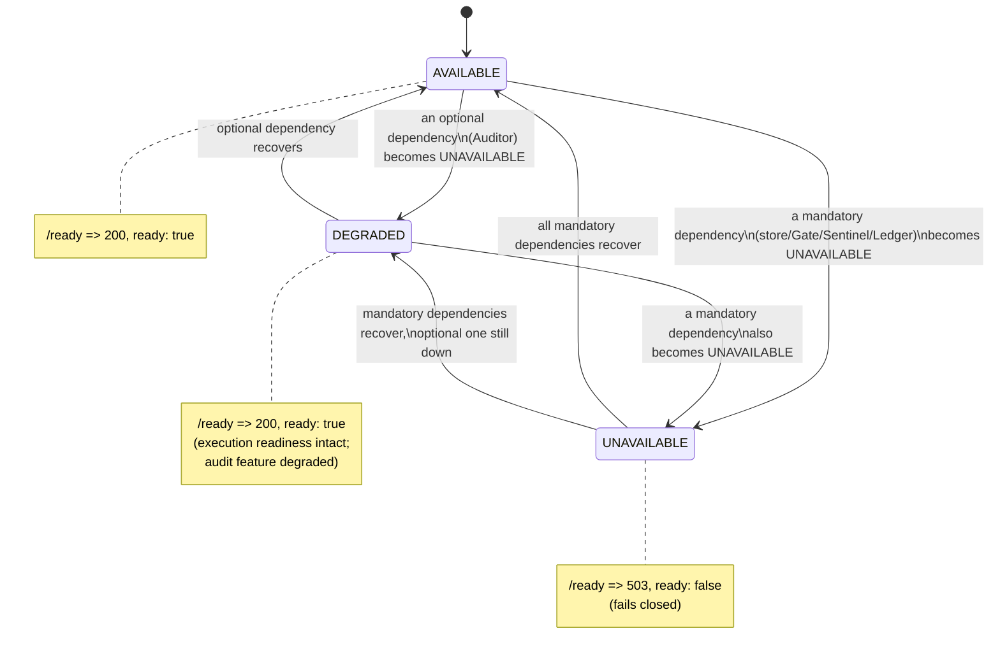

# TNA Deployment Engineering v0.1 — Health Model

## Liveness vs. readiness (section 31)

`GET /live` — **LIVE** means the process is running and can answer HTTP at all. Unauthenticated (a
container orchestrator's liveness probe carries no credential). Returns `{ live: true, uptime_seconds }`.

`GET /ready` — **READY** means the process can safely accept intended work: its mandatory dependencies
(its own durable store, Gate, Sentinel, Ledger) are reachable. Also unauthenticated, but leaks nothing
beyond component name/status/latency-class/an optional bounded message (section 34) — never a
credential, never a stack trace. Returns 200 when ready, 503 when not.

The two are never conflated: `packages/deployment-health`'s `liveness()` and `aggregateReadiness()` are
separate functions with separate contracts, proven separately (`deployment-health.test.ts`).

## Readiness requirements (section 32)

Mandatory (an outage makes `/ready` return 503):

- `platform_store` — the platform's own `PlatformStore`
- `gate` — Gate's own evidence store
- `sentinel` — `SentinelRuntime`'s active policy
- `ledger` — `LedgerStore`'s stream index

Optional (an outage degrades overall status but does not block readiness):

- `auditor` — strictly post-hoc, never in the critical execution path (TNA-43); its unavailability means
  the audit *feature* is degraded, not that ordinary governed-action execution is unsafe.

Proven directly, both in-process (`deployment-health.test.ts`) and over real HTTP against a real Gate/
Sentinel/Ledger/Auditor stack (`deployment-health-http.test.ts`, including a genuinely closed Sentinel
store producing a real 503).

## Degraded state (section 33)

`ComponentStatus` is `AVAILABLE | DEGRADED | UNAVAILABLE`. `aggregateReadiness()`'s rule:

- any **mandatory** component `UNAVAILABLE` → overall `UNAVAILABLE`, `ready: false`
- otherwise, any component not `AVAILABLE` (including an **optional** one being `UNAVAILABLE`) → overall
  `DEGRADED`, `ready: true`
- everything `AVAILABLE` → overall `AVAILABLE`, `ready: true`

This is the literal mechanism behind Flow 6 of the deployment demo: Auditor down → `DEGRADED` +
`ready: true`; Sentinel down → `UNAVAILABLE` + `ready: false`.

## Health must not leak secrets (section 34)

`ComponentHealth` carries only `component`, `status`, `mandatory`, `latency_ms`, and an optional
`message` truncated to 200 characters (`runProbe()` never forwards a raw thrown error object or stack).
Neither `/live` nor `/ready` requires a credential, so neither can ever be trusted to carry anything
secret — enforced by construction (the type itself has no field for one), not by a redaction pass applied
after the fact.

## Startup self-check (section 35)

On construction, every accepted component store runs its own existing schema-creation/ALTER-TABLE
migration logic (unchanged from the volumes that introduced it) and `PlatformStore` runs
`recoverInterruptedWork()` (Volume 8). `scripts/tna-init.ts` additionally constructs every store once
(triggering schema creation), generates the deployment identity, and verifies data-directory permissions
before declaring `INIT_COMPLETE`. `scripts/tna-verify.ts` re-runs the same readiness probes plus a
non-mutating Ledger integrity check and a component-version compatibility check, exiting non-zero on any
failure — fail-closed, not a warning.

## Failure / degraded states

## Version compatibility (section 36)

`packages/deployment-ops`'s `COMPONENT_VERSIONS` ties each component's expected version to the actual
accepted git tag (`tna-gate-v0.3`, `tna-ledger-v0.1`, `tna-sentinel-v0.1`, `vad-engine-v0.1`,
`tna-auditor-v0.1`, `tna-platform-v0.1`) — traceable to a real accepted commit, not an arbitrary label.
`assertVersionCompatible()` is exercised both by `scripts/tna-verify.ts` (self-consistency check) and by
`restoreBackup()` (a restored backup's recorded versions must match this build's own, or restore is
refused with `VERSION_INCOMPATIBLE` — never a generic/opaque database error, section 100).
