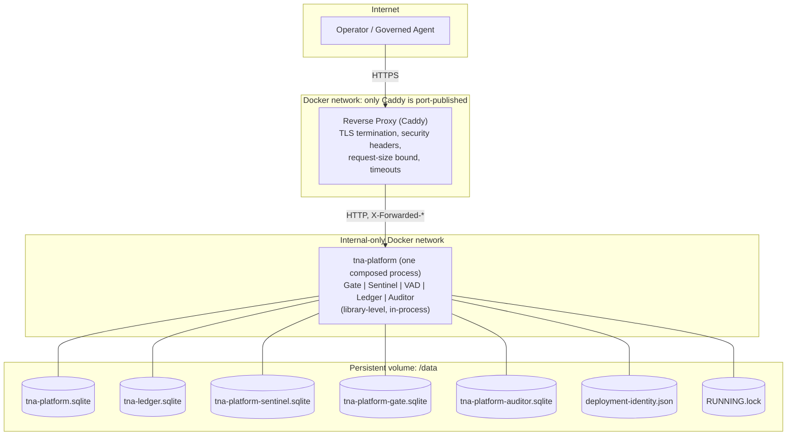
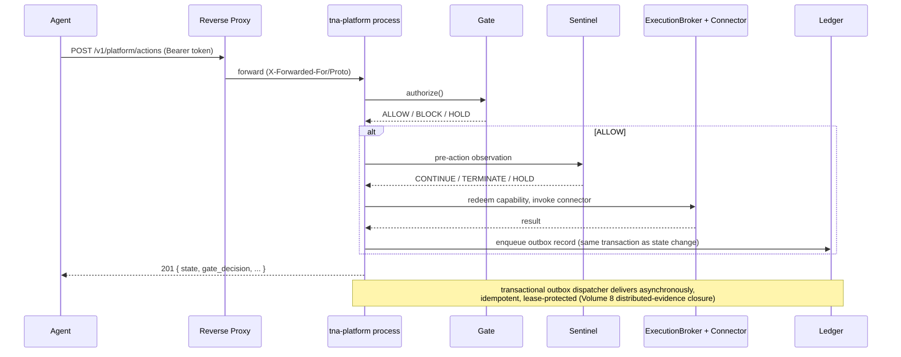

# TNA Deployment Engineering v0.1 — Topology

## Process model (section 7)

Gate, Sentinel, VAD, Ledger, and Auditor are accepted **library packages**, not independently deployed
services — they always have been, since Volume 8's own `apps/tna-platform` composition. Volume 9 does
not change that. The chosen process model is therefore **B: one platform composition process** (plus one
reverse proxy in production), not a mesh of independently-deployed component services:

- It is the architecture that best preserves the accepted component boundaries without artificial
  complexity (section 7) — splitting Gate/Sentinel/Ledger into separate network services would require
  *inventing* new network APIs for them, none of which are accepted, tested, or authorized by this
  milestone's scope.
- Every accepted structural guarantee (no direct connector invocation, no Gate bypass, Auditor never in
  the critical path) is a compile-time/library-boundary guarantee inside that one process — deploying it
  as one process does not weaken any of them, and splitting it into network services would require a new
  service-to-service authentication and authorization layer that does not exist and is out of scope
  (section 3: no service mesh).

## Topology diagram

## Database ownership (section 13)

| File | Owner | Written by |
|---|---|---|
| `tna-platform.sqlite` | `PlatformStore` | only the platform process |
| `tna-ledger.sqlite` | `LedgerStore` / `Ledger` | the platform's outbox dispatcher (writer), read by Auditor's evidence provider (reader) — no other writer |
| `tna-platform-sentinel.sqlite` | `SentinelRuntime` | only the platform process's Sentinel instance |
| `tna-platform-gate.sqlite` | `Gate` / `ExecutionBroker` | only the platform process's Gate instance — a **separate** file from the standalone `apps/tna-gate-api`'s own store (unchanged from Volume 8) |
| `tna-platform-auditor.sqlite` | `AuditorRuntime` | only the platform process, only from its own post-hoc assessment calls |
| `deployment-identity.json` | `deployment-ops` | written once at first `initDeploymentIdentity()` call, read-only afterward |
| `RUNNING.lock` | `deployment-ops` | written by the live process on startup, removed on clean shutdown |

No component casually writes another component's database file — each is opened only by its own owning
class, exactly matching the accepted Volume 8 architecture. Deployment engineering did not introduce any
cross-component SQLite mutation shortcut.

## Governed action flow

## Persistent volumes (section 12)

Every durable SQLite store lives under one operator-configured `TNA_DATA_DIR` (`/data` in the container
image), mounted as a named Docker volume in production (`compose.production.yaml`) — never inside the
container's writable layer, which is discarded on every `docker rm`. See `deployment-container-v0.1.md`.
