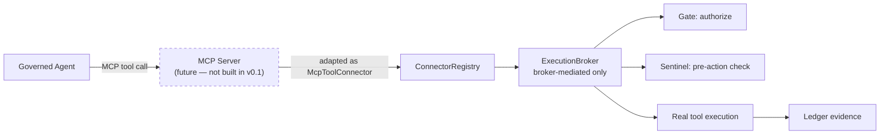

# TNA Deployment Engineering v0.1 — MCP Deployment Boundary (Document Only)

Section 126: preparation for eventual client/MCP deployment understanding. **No MCP support is built in
this milestone** — `packages/platform-connectors`'s `McpToolConnector` remains a type-only boundary
(`platform-mcp-boundary-v0.1.md`, Volume 8, unchanged). This document explains, for deployment purposes
only, what MCP is, where a real MCP server would sit in the topology this volume actually built, and why
it can never bypass Gate — so a future implementation has a deployment target to build toward.

## What MCP is

The Model Context Protocol (MCP) is a standard transport/interface by which an AI agent's runtime
discovers and invokes external "tools" exposed by an MCP server — typically over stdio or a local/remote
network transport. It standardizes tool discovery and invocation shape; it says nothing about
authorization, evidence, or containment, which is exactly the gap TNA exists to fill.

## Where an MCP server would sit relative to TNA

An MCP server, if implemented, would be **another trusted connector registration**, structurally
identical to today's `DEMO_ECHO_CONNECTOR` — registered at trusted startup (`buildDefaultConnectorRegistry`),
never from caller/request input, and reachable only through `ExecutionBroker.redeem()`, exactly like every
other connector. It does not become a second, parallel execution path.

## Why MCP does not bypass Gate

`ToolRegistry.invoke()` is broker-only by Gate's own accepted design (Volume 1-3) — there is no code path
from any registered tool, MCP-backed or not, to execution without first passing through
`PlatformGateOrchestrator.authorize()` reaching `AUTHORIZED`. An `McpToolConnector` is still, structurally,
a `ToolConnector` (`platform-mcp-boundary-v0.1.md`) — the type system itself makes "an MCP tool receives
no special trust merely for being MCP" impossible to accidentally violate.

## How connector credentials should flow (deployment-layer restatement)

Whatever credential an MCP server needs to reach its own backing service must be supplied through this
milestone's own secret-reference model (`deployment-secrets-v0.1.md`) — an env value or a mounted secret
file, never a literal value embedded in `DeploymentConfig`, and never written into a Ledger event payload
(Ledger events already carry a secret-shaped-field rejection from `platform-schema`, unchanged). In
container terms: an MCP server's own credentials, if it is deployed as a sidecar container, would be
mounted the same way `compose.production.yaml` mounts the platform's own tokens — as Docker secrets,
never as plaintext `environment:` values in a committed compose file.

## What is not implemented yet

No MCP client, no transport, no local server fixture, no sidecar container definition, and no compose
service for an MCP server exist anywhere in this repository. Building any of that is explicitly out of
scope for Volume 9 — this document exists only so the deployment target is understood in advance, not so
that MCP work is silently started.
